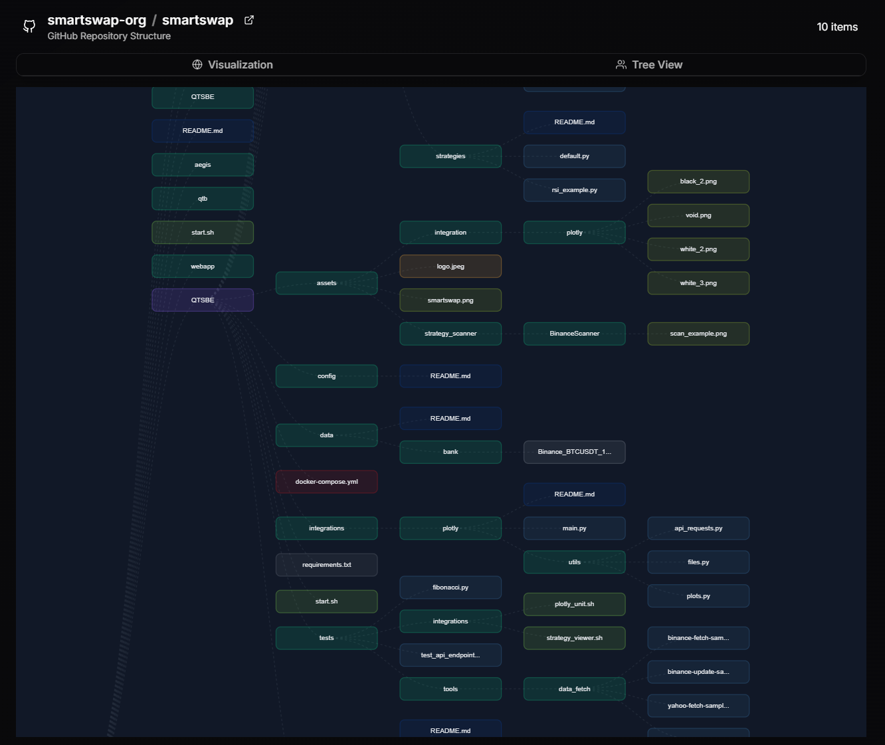

# GitHub Project Viewer

A web application that visualizes GitHub repository relationships and dependencies through an interactive graph interface.

## Technical Stack

### Frontend


### Backend


### API


## Overview

GitHub Project Viewer allows you to explore and visualize GitHub repositories. The application creates interactive network graphs showing relationships between repositories, making it easier to understand project dependencies and connections.
This tool can be particularly useful for quickly showcasing structured Git projects, exploring new libraries, presenting projects. It provides an intuitive visual approach to understanding complex repository relationships and repos dependencies.




## Features

- Interactive network graph visualization of GitHub repositories
- Repository relationship exploration
- Clean and intuitive user interface
- Real-time data fetching from GitHub API

## Limitations
> [!IMPORTANT]  
> GitHub API rate limiting may affect the number of requests possible (50/hours).

> [!IMPORTANT]  
> Large repositories with many dependencies might take longer to load.

> [!NOTE]
> Currently limited to public repositories.

> [!WARNING]  
> Big projects like `facebook/react` may take a lot of time to load and laggy explore depending your zoom.

## Getting Started

1. Clone the repository
2. Install dependencies:
```bash
npm install
```
3. Start the development server:
```bash
npm run dev
```
4. Build & run:
```bash
npm run build
npm run start
```

## License

This project is licensed under the MIT License - see the LICENSE file for details.
